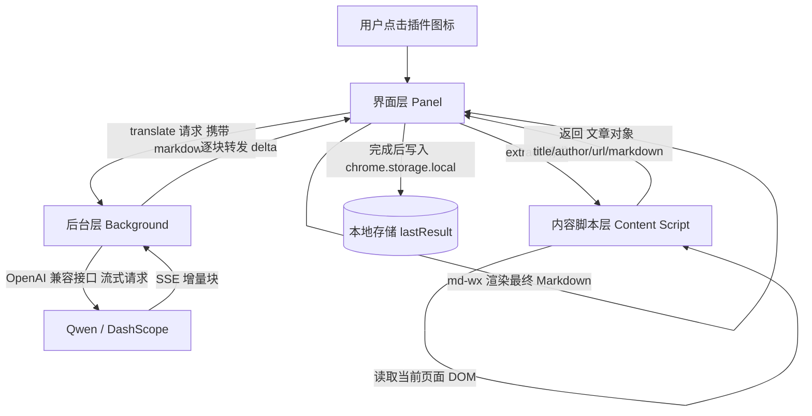
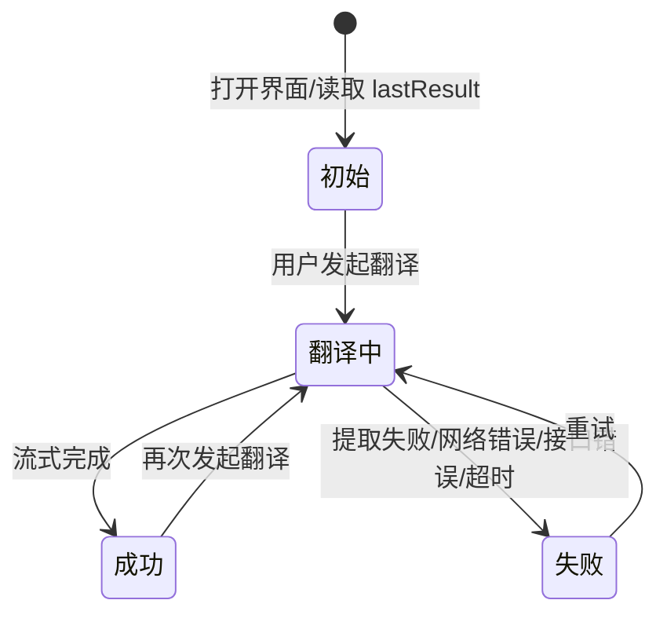

# Chrome 英文网页 AI 翻译插件 —— 技术架构设计文档

## 1. 文档信息

- **关联文档**：`docs/proposal.md`（产品需求文档）
- **文档类型**：技术架构设计文档
- **适用平台**：Chrome 浏览器扩展（Manifest V3）
- **技术栈基线**：TypeScript + React + Vite

本设计文档描述插件整体架构、关键技术选型、目录结构与编码规范，为后续实现提供依据。文档不包含具体实现代码。

## 2. 设计目标

在满足需求文档全部功能（页面提取、Markdown 整理、AI 翻译、打字机动态展示、最近一次结果本地持久化）的前提下，达成以下架构目标：

1. **内容提取高质量**：正文提取是本插件的关键难点，采用经过生产验证的方案，尽量消除导航、广告等噪音，并保留图片与结构。
2. **模型可切换**：翻译层基于 OpenAI 兼容接口抽象，切换模型（本项目使用通义千问 Qwen）仅需修改配置，不修改业务代码。
3. **结构清晰**：按职责划分模块，明确目录与编码规范，保证可维护、可测试、可扩展。
4. **渲染复用**：翻译结果使用 `md-wx` npm 组件渲染，避免自研 Markdown 渲染，保证展示质量。
5. **轻量与隐私**：仅保留最近一次结果于本地，最小化权限与网络请求。

## 3. 总体架构

### 3.1 架构分层

插件按运行环境划分为三层，分别运行于不同的浏览器上下文：

- **内容脚本层（Content Script）**：注入并运行在目标网页中，负责读取页面 DOM，提取文章并转换为 Markdown。可访问页面内容，但不能直接跨域调用翻译接口。
- **后台层（Background Service Worker）**：扩展进程，持有 AI 客户端配置，发起翻译请求并接收流式结果，向 UI 层转发增量内容。可跨域访问翻译服务域名。
- **界面层（Panel / Popup UI）**：React 应用，负责交互、状态流转、打字机效果展示、结果渲染与本地持久化。使用 `md-wx` 渲染 Markdown。

三层之间通过 Chrome 消息机制通信，共享的类型与存储封装放在共享层。

### 3.2 总体数据流



### 3.3 模块职责划分

| 模块 | 运行位置 | 职责 | 对外依赖 |
|------|----------|------|----------|
| 文章提取器 | 内容脚本层 | 从页面 DOM 提取标题、作者、正文 HTML，并转换为 Markdown | Readability、Turndown |
| 元数据补充器 | 内容脚本层 | 从 meta 标签、JSON-LD、页面结构补充标题/作者 | 无 |
| 翻译客户端 | 后台层 | 基于 OpenAI 兼容接口创建客户端、组装提示词、发起流式翻译 | `openai` SDK |
| 流式转发器 | 后台层 | 将模型返回的增量块转发给界面层 | Chrome 消息 |
| 界面状态机 | 界面层 | 管理初始/翻译中/成功/失败各状态 | 无 |
| 打字机渲染器 | 界面层 | 累积增量内容并按节奏刷新 | 无 |
| 结果渲染器 | 界面层 | 渲染最终 Markdown 结果 | `md-wx` |
| 最近结果存储 | 界面层/共享层 | 持久化并读取最近一次翻译结果 | `chrome.storage.local` |
| 设置存储 | 共享层 | 读写模型、密钥、地址等配置 | `chrome.storage.local` |

### 3.4 关键设计决策

| 决策点 | 结论 | 理由 |
|--------|------|------|
| 提取运行位置 | 内容脚本中直接读取已渲染 DOM，而非后台抓取 HTML | 用户浏览器中 DOM 已渲染，可处理 SPA、登录墙、动态内容，避免反爬与 CORS 问题 |
| 翻译调用位置 | 统一放在后台 Service Worker | 集中管理密钥与请求、便于扩展（如未来右键菜单翻译）；通过持续消息保持 Worker 存活 |
| 模型接入 | OpenAI SDK 兼容，基地址指向 Qwen 兼容模式 | 只需改配置即可切换模型/服务商 |
| 渲染方式 | 使用 `md-wx` 组件 | 复用成熟 Markdown 渲染，支持主题与移动端预览 |
| 持久化范围 | 仅 `chrome.storage.local` 保存最近一次结果 | 符合需求：无历史记录、本地存储 |

## 4. 关键技术选型

### 4.1 内容提取方案（重点难点）

#### 4.1.1 选型结论

采用 **Mozilla Readability**（正文提取） + **Turndown / turndown-plugin-gfm**（HTML 转 Markdown）的组合。该组合是当前浏览器端文章提取的事实标准，也是 Firefox 阅读模式的底层引擎，已在大量知名扩展（MarkDownload、PagePiper、Clean Print 等）与阅读工具中经过生产验证。

#### 4.1.2 方案对比

| 方案 | 优势 | 劣势 | 结论 |
|------|------|------|------|
| Mozilla Readability | 自动评分识别正文、内置广告/导航/侧边栏剔除、自动识别标题与作者、轻量、浏览器内可直接运行 | 针对文章类页面调优，对文档/产品页/论坛页可能误判 | 采用 |
| Turndown + GFM | HTML 转 Markdown 成熟稳定、支持表格/删除线/代码块、图片转 `` | 需配合插件补充表格等扩展 | 采用 |
| Mercury Parser | 元数据更丰富 | 维护活跃度下降、体积更大 | 不采用 |
| Fathom | 规则可训练、灵活 | 配置复杂、社区方案少、学习成本高 | 不采用 |
| 服务端抓取方案 | 后端可控、可做 JS 渲染 | 需要服务器、无法处理登录墙、有反爬风险、违背本地轻量原则 | 不采用 |

#### 4.1.3 提取流程设计

1. **克隆 DOM**：Readability 会修改传入文档，因此先在页面中对文档进行深克隆，在克隆体上执行，保证不污染用户页面。
2. **噪音预处理（可选）**：对明显的广告、评论、推荐、cookie 弹窗等容器做初步剔除，提升 Readability 评分准确度。
3. **正文提取**：调用 Readability 解析克隆文档，获得 `title`、`byline`（作者）、正文 HTML。
4. **元数据补充**：优先使用 Readability 结果；不足时回退到 `<meta property="og:title">`、`article:author`、JSON-LD 结构化数据、`<article>` 语义元素等；最终兜底使用 `document.title`。
5. **HTML 转 Markdown**：用 Turndown（启用 GFM 插件）将正文 HTML 转为 Markdown：
   - 标题使用 ATX 风格（`#`），保证结构与原文层级一致。
   - 图片自动转换为 ``，`alt` 取自图片替代文本，缺失时为空。
   - **相对路径转绝对路径**：将图片 `src` 等相对地址基于页面 `baseURI` 解析为绝对 URL，确保后续可访问。
6. **懒加载图片处理**：对 `loading="lazy"`、`data-src`/`data-original` 等懒加载图片，在提取前将候选真实地址写入 `src`，避免漏图。
7. **兜底策略**：若 Readability 未识别到正文，回退尝试 `<article>` 元素或正文文本密度启发式；仍失败则判定"当前页面不适合文章翻译"，交由 UI 提示用户。
8. **URL 记录**：记录当前页面地址作为"原始文章 URL"。

#### 4.1.4 提取质量边界

- 对标准文章类页面（新闻、博客、技术文章、产品文档）达到高识别率。
- 对强动态渲染、无限滚动、纯交互型页面（如社交信息流）可能识别有限，属于已声明的能力边界（见需求文档"范围限制"）。
- 提取结果需在实现阶段用多组页面样例做回归测试（见测试策略）。

### 4.2 AI 翻译方案

#### 4.2.1 选型结论

翻译层采用 **OpenAI SDK 兼容模式**：直接使用官方 `openai` npm 包，通过配置 `baseURL` 与 `apiKey` 指向目标服务商。本项目默认接入 **通义千问 Qwen（阿里云百炼 DashScope 兼容模式）**。

- **兼容基地址**：`https://dashscope.aliyuncs.com/compatible-mode/v1`
- **认证**：DashScope API Key
- **可选模型**：`qwen-turbo`、`qwen-plus`、`qwen-max` 等，默认建议 `qwen-plus`（性能与成本均衡），均可在设置中切换。

#### 4.2.2 设计要点

1. **配置化模型**：模型名、基地址、API Key 均存于本地设置，切换模型仅需修改配置，不修改业务代码。
2. **统一客户端抽象**：后台层只面向一个"翻译服务"接口，内部持有 OpenAI 兼容客户端；未来切换其他服务商仅调整客户端构造参数。
3. **流式翻译**：以 `stream` 方式调用聊天补全接口，逐块读取增量内容（SSE），实时转发给界面层，实现打字机效果。
4. **提示词设计原则**（实现时落为常量配置）：
   - System 设定翻译规范：将英文 Markdown 翻译为中文，保留标题层级、列表、引用、代码块、表格结构。
   - 明确要求图片语法 `` 原样保留，不得把图片转为普通文本。
   - 明确输出格式：一级标题、作者与原文链接引用块、翻译正文。
   - 禁止输出与文章无关的解释或额外说明。
5. **上下文长度管理**：超长文章在送入模型前做长度预检；必要时对超长正文按边界截断并提示，避免超出模型上下文（首版采用朴素截断策略，不做 RAG）。
6. **错误分类**：统一识别认证失败、限流、网络错误、超时、内容为空等错误类型，映射为 UI 可展示的错误提示。

#### 4.2.3 模型切换方式

通过设置面板修改以下配置即可切换模型或服务商，无需改动代码：

- 服务基地址（默认 Qwen 兼容地址）
- API Key
- 模型名
- 温度等采样参数（提供默认值）

### 4.3 前端渲染方案（md-wx）

- `md-wx` 为 npm 包，随项目依赖安装，在 React 项目中引入 `MarkdownRenderer` 组件及其样式文件即可使用。
- 翻译完成的 Markdown 结果交由 `MarkdownRenderer` 渲染；通过主题、跟随系统主题、视图模式等属性提供可配置展示（属性细节以 `docs/md-wx-api-usage.md` 为准）。
- 打字机效果作用于外层展示层：界面层将流式增量内容累积为"当前完整 Markdown"，按节奏更新并交由渲染器刷新，而非逐字符插入已渲染 DOM，从而兼顾打字机效果与渲染稳定性。
- 性能控制：对长文采取节流刷新（如限制渲染频率或分块追加），避免每次增量都触发全量重渲染导致卡顿。

## 5. 目录结构规范

### 5.1 整体目录

```text
chrome-extension-en-transiation/
├── docs/                        # 需求与设计文档（proposal.md / design.md）
├── public/                      # 静态资源：图标、默认样式等
├── src/
│   ├── content/                 # 内容脚本层（注入页面）
│   │   ├── extractor/           # 文章提取与 Markdown 转换
│   │   ├── meta/                # 元数据补充（meta / JSON-LD）
│   │   └── index.ts             # 内容脚本入口，消息监听
│   ├── background/              # 后台层（Service Worker）
│   │   ├── services/            # AI 翻译客户端与流式转发
│   │   └── index.ts             # 后台入口，消息路由
│   ├── panel/                   # 界面层（React）
│   │   ├── components/          # 界面组件（状态、打字机、结果渲染等）
│   │   ├── hooks/               # 自定义 Hook
│   │   ├── store/               # 界面状态管理
│   │   ├── styles/              # 界面样式
│   │   └── index.tsx            # 界面入口
│   ├── shared/                  # 跨层共享
│   │   ├── types/               # 类型定义
│   │   ├── messages/            # 消息协议定义与封装
│   │   ├── storage/             # chrome.storage 读写封装
│   │   └── constants/           # 常量（默认模型、提示词、默认配置）
│   └── config/                  # 构建期配置（manifest 生成、环境变量）
├── manifest.json                # 扩展清单（或由构建生成）
├── package.json
├── tsconfig.json
├── vite.config.ts               # 构建配置（若采用 Vite）
└── eslint.config.mjs / .prettierrc  # 代码规范配置
```

### 5.2 目录职责约定

| 目录 | 允许内容 | 禁止内容 |
|------|----------|----------|
| `src/content` | 页面内提取逻辑，可读 DOM | 不直接调用 AI 接口 |
| `src/background` | 翻译调用、流式转发、消息路由 | 不包含界面逻辑 |
| `src/panel` | React 界面、状态、渲染 | 不包含提取与 AI 直连逻辑（AI 统一走后台） |
| `src/shared` | 类型、消息协议、存储、常量 | 不包含业务实现 |
| `src/config` | 构建与运行配置 | 不包含业务代码 |

### 5.3 依赖方向

- 依赖单向：`panel` → `shared`；`background` → `shared`；`content` → `shared`。
- `shared` 不得反向依赖任何上层模块，保证共享层可独立测试。
- 界面层不直接持有 AI 客户端与提取逻辑，只通过消息协议与后台、内容脚本交互。

### 5.4 构建工具选型

- 采用 **Vite + TypeScript + React** 构建；扩展脚手架选用支持 Manifest V3 的 Vite 扩展插件（如 `@crxjs/vite-plugin`，WXT 作为备选），保证 content / background / panel 多入口分别打包。
- `manifest.json` 由构建配置生成，权限、图标、入口统一管理。

## 6. 编码规范

### 6.1 语言与类型

- 统一使用 **TypeScript**，开启 `strict` 模式，禁止 `any`（确需使用窄化类型如 `unknown` 后收窄）。
- 业务类型（文章对象、消息载荷、存储结构）集中定义于 `shared/types`，跨层复用。
- 所有函数与模块给出类型签名；公共类型需附带说明注释。

### 6.2 命名规范

| 类别 | 规范 | 示例 |
|------|------|------|
| 文件/目录 | kebab-case | `extractor/`, `article-extractor.ts` |
| 变量/函数 | camelCase | `extractArticle` |
| 组件/类/类型 | PascalCase | `MarkdownRenderer`、`Article` |
| 常量/枚举值 | UPPER_SNAKE_CASE | `DEFAULT_MODEL` |
| React Hook | `use` 前缀 | `useTypingEffect` |
| 类型命名 | 以 `Type`/`Payload`/`Result` 等结尾明确语义 | `ExtractResult` |

### 6.3 代码风格

- 使用 ESLint + Prettier 统一风格；格式化由 Prettier 强制执行，提交前检查通过。
- 异步一律使用 `async/await`，禁止回调嵌套；Promise 必须处理拒绝。
- 导入顺序约定：外部依赖 → 本层模块 → 共享模块 → 常量/类型；按此分组排序。
- 避免魔法数字/字符串，集中放于 `shared/constants`。
- 注释使用中文，用于解释"为什么"而非复述代码；逻辑自明处不加注释。

### 6.4 模块与职责

- 单一职责：每个模块只做一件事，功能复杂时拆分子模块。
- 禁止跨层直连：界面层不得直接 import 内容脚本或后台内部实现。
- 边界错误处理：所有对外边界（消息解析、存储读写、AI 调用）必须做防御性校验并返回结构化错误（见第 9 节）。
- 不保留调试输出：提交前清除 `console.log` 等调试代码；日志经统一日志工具输出。

### 6.5 提交与文档约定

- 提交信息遵循简洁约定，格式：`类型(范围): 描述`，类型包括 `feat` / `fix` / `refactor` / `docs` 等。
- 对外暴露的接口（消息协议、存储结构）变更需同步更新设计文档与类型定义。
- 新增依赖需说明用途与版本，避免引入无关依赖。

## 7. 消息通信协议

### 7.1 总体约定

- 所有跨层通信使用 Chrome 消息机制（`runtime.sendMessage` / `onMessage`）。
- 消息类型、载荷结构集中定义于 `shared/messages`，形成单一事实来源。
- 异步消息处理必须保持消息通道（异步场景不得提前关闭响应通道）。
- 消息采用"请求-响应 + 事件推送"两种模式：单次请求用请求-响应；流式增量用事件推送。

### 7.2 主要消息

| 方向 | 类型 | 载荷 | 响应 |
|------|------|------|------|
| Panel → Content | 提取文章 | 当前页面信息 | 文章对象或提取失败原因 |
| Panel → Background | 发起翻译 | Markdown 原文 + 配置 | 任务标识或启动失败原因 |
| Background → Panel | 增量块 | 任务标识 + 文本增量 | - |
| Background → Panel | 完成/失败 | 任务标识 + 结果/错误 | - |
| Panel → Content | 获取当前 URL | 无 | 当前页面 URL |

### 7.3 消息设计约定

- 每个消息类型对应明确的载荷与错误类型，错误统一携带 `code` 与 `message`。
- 流式过程以"任务标识"关联增量与完成事件，避免并发翻译互相干扰（界面层同一时间仅允许一个进行中的任务）。

## 8. 数据与存储设计

### 8.1 存储范围

仅使用 `chrome.storage.local`，不建立服务端存储。

### 8.2 存储键设计

| 存储键 | 内容 | 说明 |
|--------|------|------|
| `lastResult` | 最近一次翻译结果对象 | 包含标题、作者、原文 URL、最终 Markdown、保存时间 |
| `settings` | 用户配置 | 基地址、API Key、模型名、采样参数、默认值 |

### 8.3 最近一次结果规则

- 仅在翻译**成功完成后**写入 `lastResult`，覆盖旧值。
- 正在生成中或失败的结果不写入。
- 打开界面时读取 `lastResult` 并优先展示。
- 不做历史列表、删除单条、恢复旧记录等能力。

### 8.4 配置安全

- API Key 仅存于本地 `chrome.storage.local`，不硬编码进代码、不写入日志、不发送到除配置基地址外的任何服务。
- 密钥相关配置建议提供设置界面输入与清除入口。

## 9. 错误处理与界面状态

### 9.1 状态机

界面层状态流转如下：



### 9.2 错误分类与映射

| 错误码域 | 场景 | 用户提示方向 |
|----------|------|--------------|
| `EXTRACT_EMPTY` | 无法识别正文 | 提示当前页面不适合，可重试 |
| `EXTRACT_FAILED` | 提取过程异常 | 提示重试 |
| `AUTH_FAILED` | API Key 无效 | 引导检查设置 |
| `RATE_LIMITED` | 触发限流 | 提示稍后重试 |
| `NETWORK_ERROR` | 网络中断/超时 | 提示检查网络并重试 |
| `EMPTY_RESPONSE` | 模型返回为空 | 提示重试 |
| `UNKNOWN` | 其他异常 | 通用失败提示 |

### 9.3 失败不破坏结果

- 翻译失败不得覆盖 `lastResult`。
- 失败后保留界面中已生成的部分内容展示，但不标记为完成，允许用户重试或关闭。

## 10. 安全与隐私

- 权限最小化：仅申请完成功能所需权限（如 `activeTab`、`scripting`、`storage`，以及访问翻译服务域名的 host 权限），不使用无关权限。
- 页面内容仅用于本次翻译请求，不缓存、不统计、不用于其他目的。
- 翻译内容只发送到用户配置的翻译服务地址。
- 本地存储仅含最近一次结果与配置；无账号、无云端同步。

## 11. 测试策略

| 层级 | 对象 | 方法 |
|------|------|------|
| 单元测试 | 提取器、Markdown 转换、提示词组装、长度截断 | 使用多组文章 HTML 样例断言标题/作者/图片/结构 |
| 单元测试 | 消息协议与存储封装 | 模拟 Chrome API 断言载荷与错误映射 |
| 集成测试 | 翻译流式链路 | Mock OpenAI 兼容接口，验证增量块顺序与完成事件 |
| 手动测试 | 界面与打字机效果、持久化 | 真实页面加载未打包扩展验证 |

- 提取器测试需覆盖：标准文章页、含懒加载图片页、相对路径图片页、无作者页、无法识别页。
- 翻译测试需覆盖：长文截断、流式中断、认证失败、限流、空响应。

## 12. 风险与边界

| 风险 | 说明 | 应对 |
|------|------|------|
| 提取准确度 | 复杂/动态页面识别不理想 | 已选最成熟的 Readability 方案，声明能力边界，保留兜底与用户重试 |
| MV3 Worker 生命周期 | 长流式任务期间 Worker 可能被回收 | 通过持续消息/心跳保持活跃；必要时将调用下沉至界面层（架构已预留该可能） |
| API Key 安全 | 扩展代码用户可见 | 密钥仅本地存储、最小权限、不做服务端中转与日志 |
| 长文性能 | 流式渲染长文卡顿 | 节流刷新、分块追加、渲染频率限制 |
| 模型输出格式漂移 | 模型偶尔不遵守输出模板 | 提示词强约束 + 完成后格式校验/修正提示 |

## 13. 参考来源

- Mozilla Readability（Firefox 阅读模式底层引擎）：`https://github.com/mozilla/readability`
- Turndown（HTML 转 Markdown）与 turndown-plugin-gfm：`https://github.com/mixmark-io/turndown`
- 通义千问 DashScope OpenAI 兼容模式基地址 `https://dashscope.aliyuncs.com/compatible-mode/v1`（阿里云百炼）
- `md-wx` 组件使用参考：`docs/md-wx-api-usage.md`（本仓库）
- 相关实践参考：MarkDownload、PagePiper、Clean Print 等基于 Readability + Turndown 的扩展项目
